# Exercicios3

**Número da Lista**: 4 
**Conteúdo da Disciplina**: Merge e Contagem de Inversões 

## Alunos

| Matrícula  | Aluno                       |
| ---------- | --------------------------- |
| 21/1029147 | Arthur de Melo Viana        |
| 21/1029666 | Matheus Henrique Dos Santos |

## Sobre

Exercícios resolvidos no Leetcode:

| Exercício                                                                                                       | Juiz Online                       |           Autor da Resolução            |
| --------------------------------------------------------------------------------------------------------------- | --------------------------------- | :-------------------------------------: |
| [4 - Median of Two Sorted Arrays](https://leetcode.com/problems/median-of-two-sorted-arrays/)                   | [Leetcode](https://leetcode.com/) | [Arthur](https://github.com/arthurmlv)  |
| [315 - Count of Smaller Numbers After Self](https://leetcode.com/problems/count-of-smaller-numbers-after-self/) | [Leetcode](https://leetcode.com/) | [Arthur](https://github.com/arthurmlv)  |
| [493 - Reverse Pairs](https://leetcode.com/problems/reverse-pairs/)                                             | [Leetcode](https://leetcode.com/) | [Arthur](https://github.com/arthurmlv)  |
| [218 - The Skyline Problem](https://leetcode.com/problems/the-skyline-problem/)                                 | [Leetcode](https://leetcode.com/) | [Matheus](https://github.com/mathonaut) |
| [23 - Merge k Sorted Lists](https://leetcode.com/problems/merge-k-sorted-lists/)                                | [Leetcode](https://leetcode.com/) | [Matheus](https://github.com/mathonaut) |
| [918 - Maximum Sum Circular Subarray](https://leetcode.com/problems/maximum-sum-circular-subarray/description/) | [Leetcode](https://leetcode.com/) | [Matheus](https://github.com/mathonaut) |

## Screenshots

As seções a seguir explicitam os exercícios resolvidos e apresentam uma breve explicação das resoluções. É possível observar o status de conclusão do problema e uma descrição do algoritmo utilizado. A dificuldadade dos exercícios do leetcode é dada de forma explícita na página do problema.

### 4 - Median of Two Sorted Arrays (Hard)

Para resolver este exercício, fez-se o uso parcial da função merge até metade do vetor para encontrar a mediana dos dois vetores ordenados.

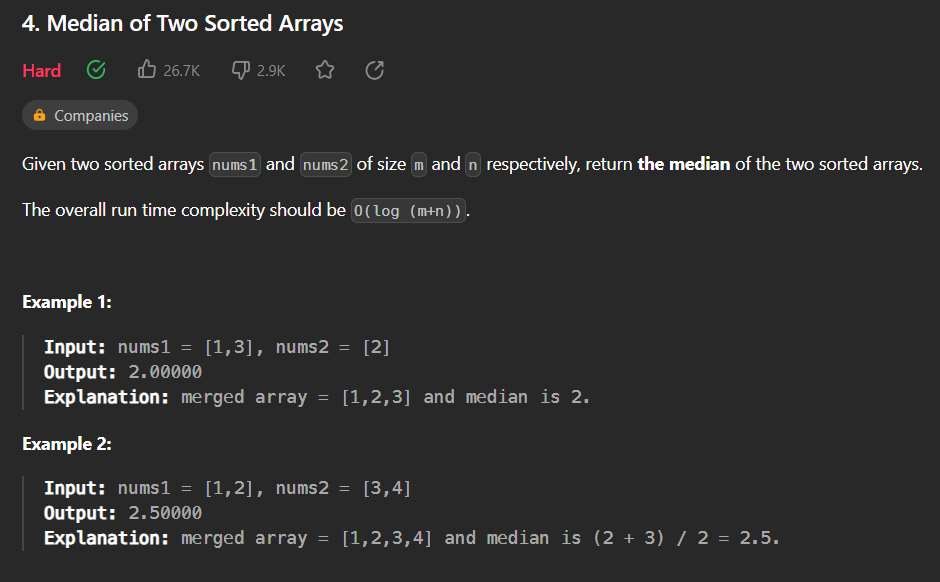
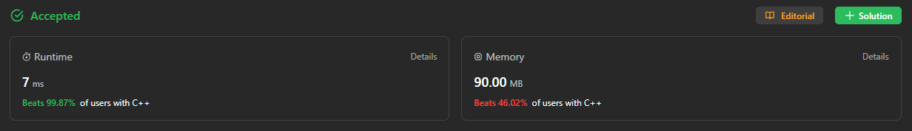

### 315 - Count of Smaller Numbers After Self (Hard)

A resolução deste exercício é feita por meio do algoritmo de contagem de inversões, o qual se trata de uma modificação do mergesort que realiza a contagem das inversões ao mesmo tempo que o vetor é ordenado. No entanto, como queria-se o valor específico das inversões de cada item do vetor, fez-se outra modificação para guardar a posição e a quantidade de inversões mesmo ao ordenar o vetor.

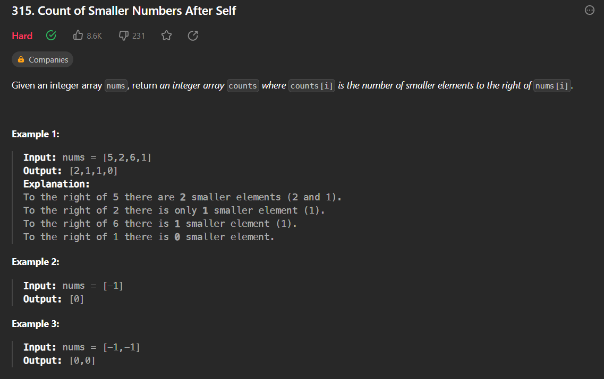
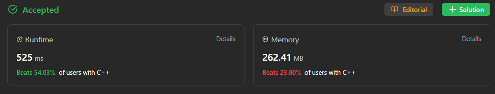

### 493 - Reverse Pairs (Hard)

A resolução deste exercício também é composta pelo algoritmo de contagem de inversões, o qual se trata de uma modificação do mergesort que realiza a contagem das inversões ao mesmo tempo que o vetor é ordenado. No entanto, para este exercício, realiza-se uma verificação das inversões, dada pela definição no enunciado, sendo um número maior que duas vezes o número sendo comparado. Após essa verificação, o merge é feito normalmente.

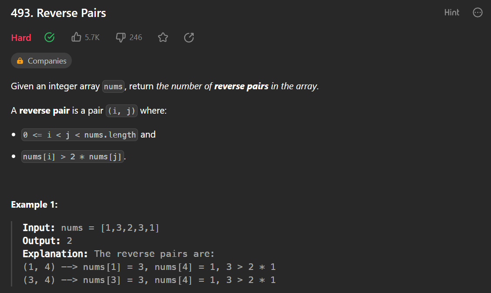
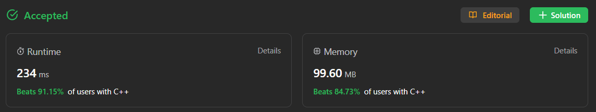

### 218 - The Skyline Problem (Hard)

A resolução deste exercício ...

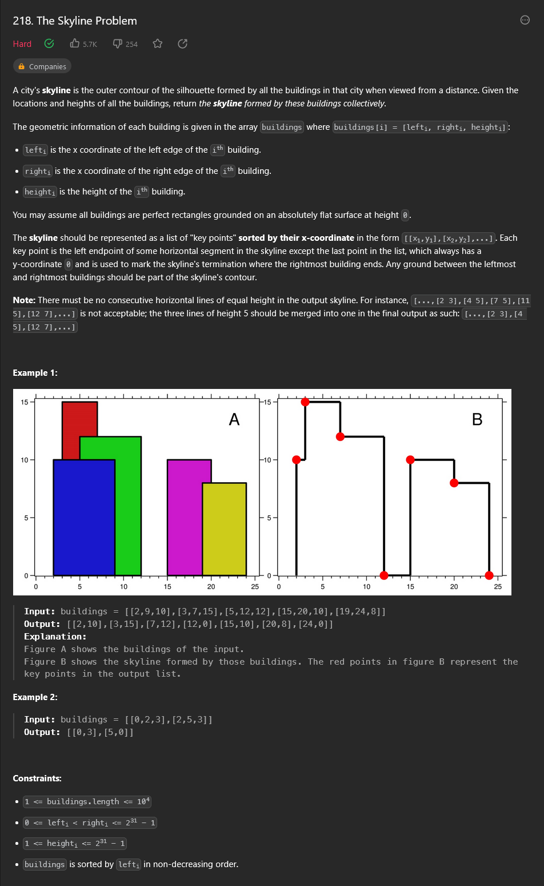
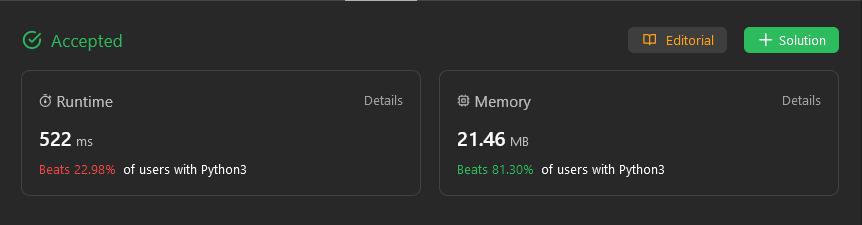

### 23 - Merge k Sorted Lists (Hard)

A resolução deste exercício ...

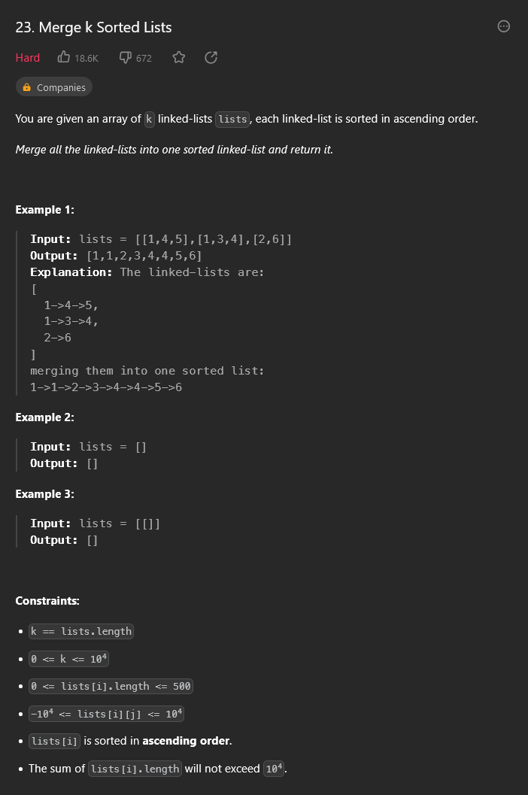
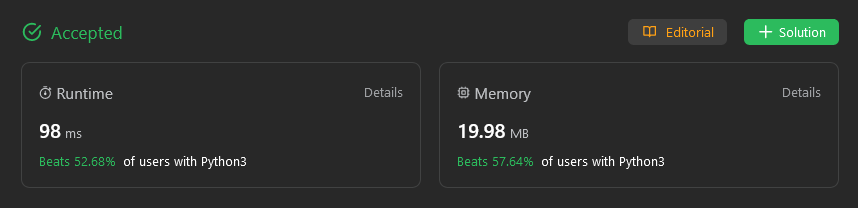

### 918 - Maximum Sum Circular Subarray (Medium)

A resolução deste exercício ...

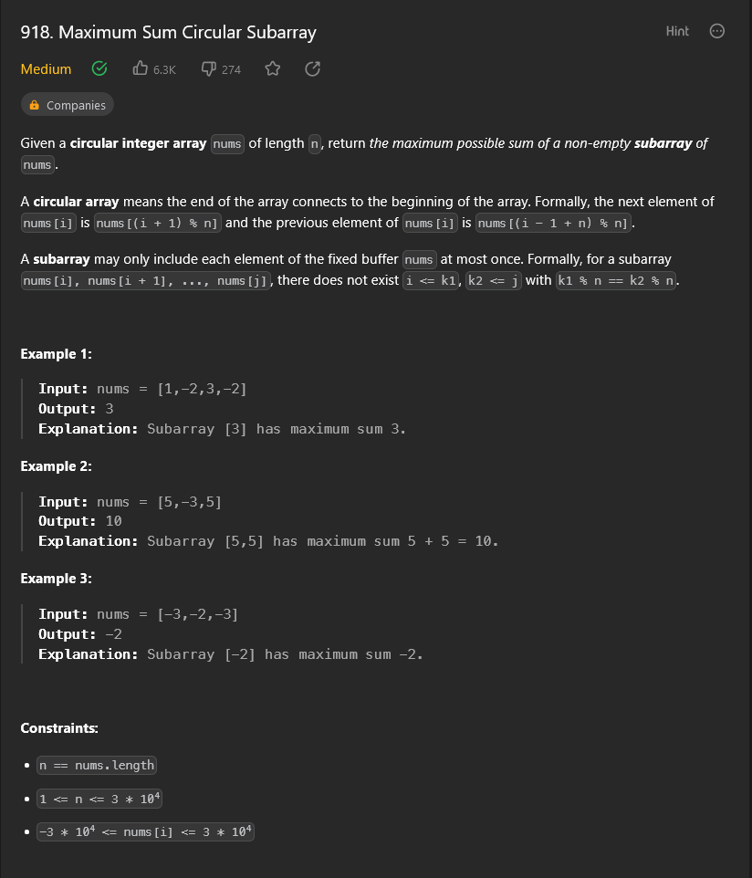
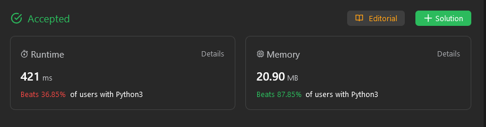

## Instalação

**Linguagens**: C++ e Python 

Para rodar os arquivos em C++, é recomendado utilizar o WSL caso esteja no Windows. Nele, execute os comandos `sudo apt update` e `sudo apt install build-essential` para instalar o g++. O código em C++ também pode ser enviado no próprio [SPOJ](https://www.spoj.com/) ou compilado e executado no [Ideone](https://ideone.com/).

Já para rodar os arquivos em Python, pode ser utilizado o interpretador online [GDB](https://www.onlinegdb.com/) ou instalar o Python na sua máquina (as instruções para instalação podem ser encontradas no [guia de instalação](https://wiki.python.org/moin/BeginnersGuide/Download)).

## Uso

Para os exercícios em C++, compile o código utilizando `g++ -o prog arquivo.cpp` e execute-o utilizando `./prog`, por fim, digite o input no terminal. Também pode ser utilizado o comando `./prog < entrada.txt` caso exista algum caso de teste válido no arquivo de texto. Os links para os problemas resolvidos estão na seção "Sobre", onde podem ser enviados para verificar se foram aceitos.

Para os exercícios em Python, basta digitar `python nome-do-arquivo.py` no terminal de preferência para rodar o código com os casos de testes dados como exemplo. Da mesma forma, a solução pode ser enviada na própria página do problema.

## Vídeo

Para acessar o vídeo explicativo sobre os exercícios, [clique aqui](https://www.youtube.com/embed/BhQEm9xUKlg).

Para baixar o vídeo, [clique aqui](apresentacao.mp4).
